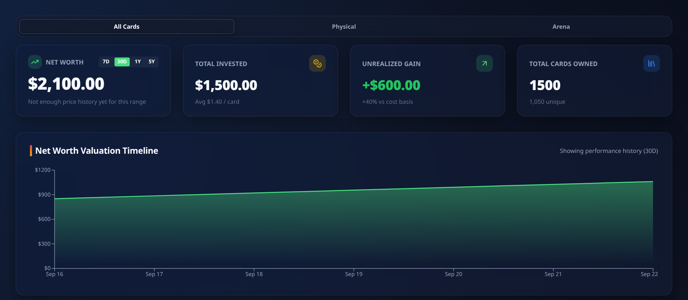
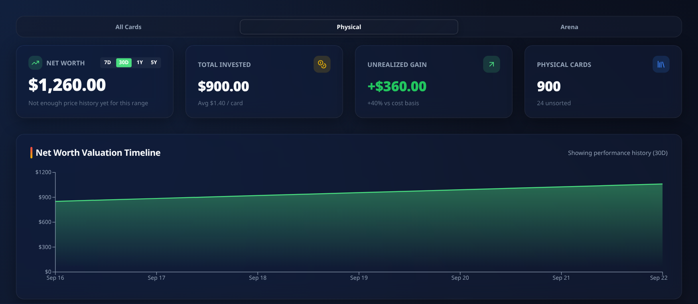
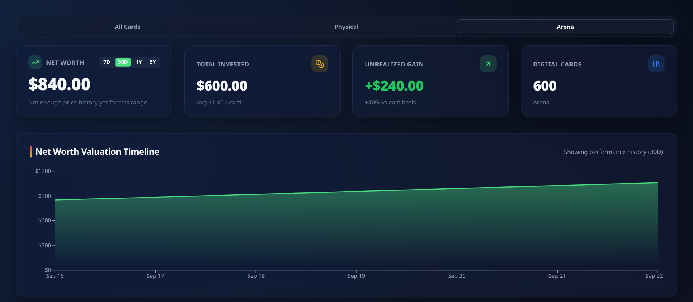
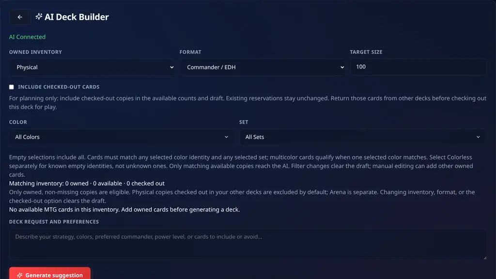
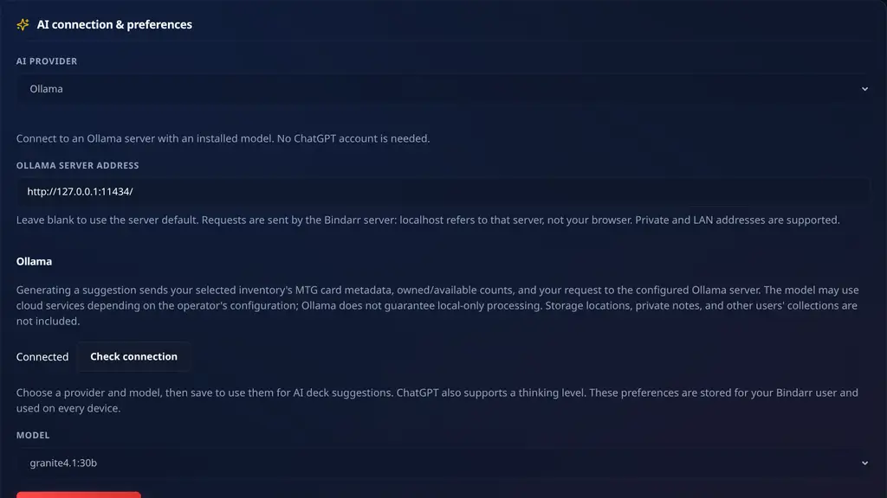
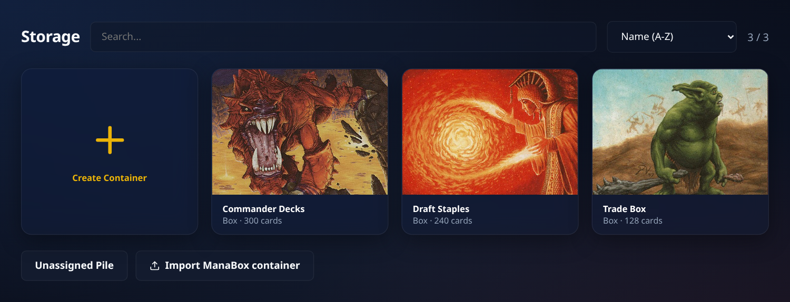
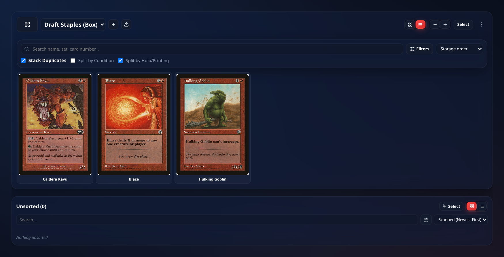
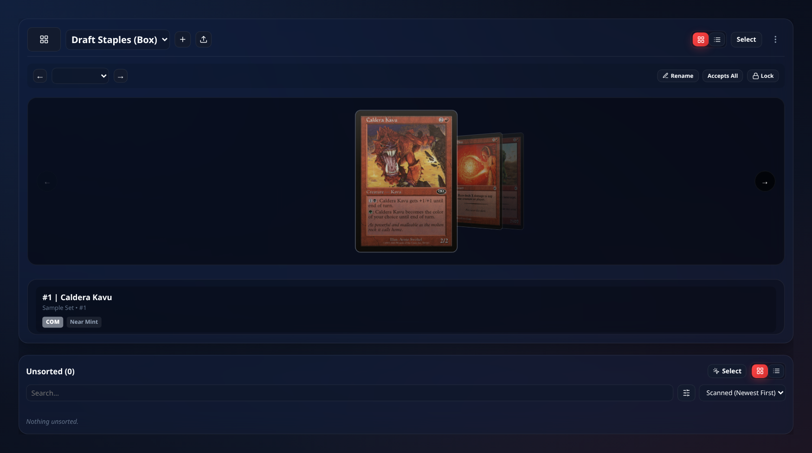
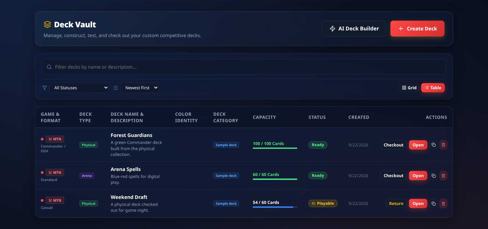
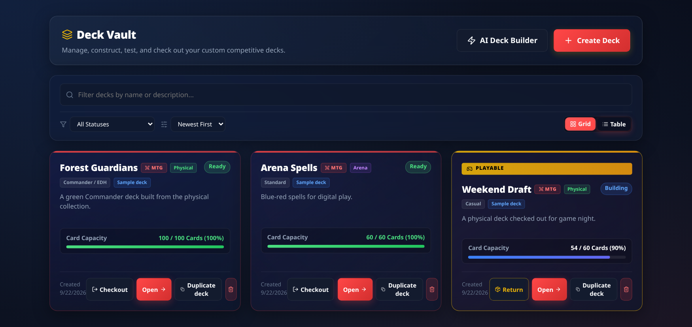

<div align="center">


# Bindarr

**Self-hosted collection, storage, and deck manager for Magic: The Gathering.**

[](https://github.com/thenotoriousJeremy/bindarr/actions/workflows/docker-build.yml)
[](https://github.com/thenotoriousJeremy/bindarr/pkgs/container/bindarr)
[](LICENSE)

[Live demo](https://thenotoriousjeremy.github.io/bindarr/) · [Install](#install) · [Workflows](#workflows) · [Architecture](PROJECT.md) · [Report a bug](https://github.com/thenotoriousJeremy/bindarr/issues/new)

</div>

Bindarr keeps the card, its printing, its condition, its value, and—when it is physical—its exact storage position together. It is a React SPA backed by Express and one SQLite database; Docker persists the database, backups, scan models, and scan catalogs in one volume.

The [live demo](https://thenotoriousjeremy.github.io/bindarr/) uses sample data. Changes are not saved there, and camera scanning requires a server installation.

## About this fork

This is [batman-2099/bindarr](https://github.com/batman-2099/bindarr), a fork of [thenotoriousJeremy/bindarr](https://github.com/thenotoriousJeremy/bindarr). It builds on upstream **1.8.5** (`404a659`) and focuses on Magic: The Gathering, physical storage, Arena inventory, and collection-to-deck workflows. The original project and its contributors provide the underlying application; the changes below describe this fork's additions and fixes rather than claiming upstream features as new work.

### Changes on `main`

**Magic-only scope and inventory**

- Made the active product Magic-only: removed Pokémon and Lorcana from core navigation, setup, controls, APIs, and product documentation. Legacy database records are retained rather than deleted.
- Added separate **Arena** inventory and **Physical/Arena** deck types, with inventory-scoped ownership and availability checks. Arena decks cannot use physical checkout or storage workflows.
- Added Arena-aware Dashboard views and statistics, plus inventory-type changes through deck properties when the destination owns sufficient copies.
- Added an explicit **Add to Wishlist** action and wishlist persistence; wishlist entries are excluded from owned-card statistics.
- Added an **Unassigned Pile** collection view and filters for unfiled cards.
- Added checked-out-card collection filters and Missing/Found tracking for individual cards and bulk selections, preserving their last known locations.
- Added duplication of eligible raw physical collection cards.
- Corrected MTG card-type filtering and restored basic-land color classification.

**Collection imports, review, and exports**

- Added ManaBox plaintext collection imports, including `.txt` uploads from Add Cards, foil markers, duplicate-printing quantities, and exact-printing resolution.
- Added CSV upload in Add Cards, including MTG Arena collection exports and Bindarr-style CSV files resolved through Scryfall.
- Added CSV review before saving: detected rows and quantities, validation errors, suggested header mappings, editable column mappings, and refreshed previews.
- Preserved the selected Collection/Arena import destination and corrected imported Magic cards being hidden from the intended view.
- Replaced unresolved CSV identifiers with canonical Scryfall printings; preserved set-specific printings when matching by name and retried rate-limited set-scoped lookups.
- Corrected missing artwork on ManaBox CSV imports.
- Added completion summaries covering successful cards, entries and copies, failures, skipped/unresolved cards, and downloadable failed-card lists for retry.
- Added timestamped import activity logs showing real lookup, cache, rate-limit, preparation, saving, completion, and failure events.
- Added a persistent local Scryfall bulk catalog used by CSV, ManaBox, precon, and container imports before API fallback.
- Added administrator-controlled daily UTC bulk-catalog refresh scheduling and an immediate download action in Settings.
- Added CSV and TXT exports of the **current visible collection view**, respecting its inventory tab, filters, sorting, and duplicate stacking; aligned the export controls with collection selection.

**Deck building and play**

- Added ManaBox deck imports and corrected ManaBox detection, Arena inventory lookup, exact-printing identity, import/export icons, and skipped-card summaries.
- Added MTGJSON precon imports with independent **Create Storage Container** and **Create Deck** checkboxes, both enabled by default; deck creation imports every card and checks out the new Physical deck atomically.
- Added editable deck properties, a Deck Type column, deck duplication, and inventory-aware Physical/Arena switching.
- Added card storage locations and sorting by container, compartment, and slot.
- Added unavailable-copy warnings and the names of checked-out decks reserving those copies; corrected checked-out availability calculations.
- Added persistent pulled-card checkboxes and resizable deck grid cards.
- Added mana/color identity and category information to deck lists.
- Added single-commander selection for Commander decks using card checkboxes and banners, with persistence in deck copies and complete backups.
- Added per-deck wins/losses and reorganized the detail view: description, overview panels, then full-width card list/grid. Record controls live in **Deck Health & Rules**.

**Storage and containers**

- Added ManaBox container imports that create a named box and file cards already owned in Unsorted instead of creating missing collection cards.
- Corrected container imports to split and place stacked copies while retaining unfiled remainders.
- Added **Move** actions to the full container-import summary to fill remaining quantities from eligible owned copies, without creating cards or moving the same copies twice on retry.
- Added expandable capacity and movement of selected cards between containers, back to Unsorted, or through automatic filing.
- Added a scalable container image grid/list with search, filters, card-state labels, missing-card indicators, sorting, grouped results, and duplicate stacking.
- Added deck-assignment indicators and In Play/Not In Play filtering, corrected to classify only copies actually allocated to checked-out decks.
- Added an action to put selected container cards into a deck.
- Alphabetized container selectors and made name sorting the default.
- Added a searchable, sortable container gallery as the Storage landing page, with card counts and artwork covers.
- Added user-selected cover artwork from cards in the container, managed through Container Settings, plus automatic-cover fallback and backup persistence.
- Refined gallery tiles to show full card artwork without card-detail overlays, and made the Storage navigation button return to the gallery.

**Settings, backups, and maintenance**

- Added configurable default collection, storage, and deck views and default card image scaling.
- Added the **Jenny** theme: purple backgrounds, lavender highlights, and orange buttons and accents.
- Added complete collection-data backup and restore, including the fork's inventory, storage, deck, and related metadata.
- Reworked the README into a Magic-focused product and workflow guide; added repository development guidance, import fixtures, and regression checks for the new workflows.

### AI Deck Builder and related improvements

The following changes were developed on the [`AI-Deck-Builder` branch](https://github.com/batman-2099/bindarr/tree/AI-Deck-Builder) (`47a3c8b`) and merged into `main` through [pull request #2](https://github.com/batman-2099/bindarr/pull/2):

- AI deck suggestions through either a per-user ChatGPT/Codex connection or an Ollama service.
- User Settings controls for provider, model, ChatGPT thinking level, and a per-user Ollama server address, with connection checking and persisted preferences.
- Physical/Arena inventory selection, color/set filters, and an explicit option to include checked-out physical copies for planning without changing existing reservations.
- Editable suggested decks, card previews, live generation logs, ownership/quantity/legality validation, and explicit atomic saving.
- Compact inventory requests, local cached rules, bounded provider requests, cancellation, and isolated Codex sessions that do not receive storage locations, private notes, or other users' collections.
- Ollama structured-output chat support for thinking models such as Qwen, with unfinished output rejected and context/output-limit errors explained.
- A compact green **AI Connected** status in Deck Builder; connection details, account identity, and data-sharing notices live in Settings.
- Development-server watch-path fixes so Codex runtime files do not restart the backend during generation.
- Additional UI refinements: the Obtained control beside the Arena badge, Collection/Arena/Unassigned/Wishlist tab ordering, alphabetical deck selectors, and resetting Deck Builder when opened from navigation.
- Corrected basic-land copy-limit detection so nonbasic dual lands are not treated as unlimited basic lands.

### Screenshots

These screenshots show the fork's interfaces using sample data, not a personal collection. Model availability and inventory counts depend on your installation.

**Dashboard — All Cards** — combined ownership totals, valuation, investment, gain, and the valuation timeline. All figures and history in these dashboard images are illustrative sample data.



**Dashboard — Physical** — physical inventory metrics and the count of unassigned physical cards.



**Dashboard — Arena** — digital inventory metrics, with Digital Cards replacing the physical count.



**AI Deck Builder** — compact green connection status, Physical/Arena selection, checked-out-copy planning, color/set filters, and the deck request. This example has an empty inventory.



**Ollama settings** — choose the provider, enter a per-user service address, check connectivity, and select an installed model. The example uses a local service address.



**Storage boxes** — artwork-covered containers with names and card counts, search and sorting, container creation, and ManaBox container import. Box names and quantities shown here are illustrative.



**Inside a container — list view** — sample card contents with search, filters, storage-order sorting, duplicate stacking, and adjustable image size.



**Inside a container — grid/gallery view** — the box layout presents cards in a carousel with the selected card's details and compartment controls.



**Deck Builder — table view** — compare sample Physical and Arena decks, formats, categories, capacity, and play status in one overview.



**Deck Builder — grid view** — the same sample decks as tiles, with completion bars and a highlighted checked-out deck.



## Highlights

- Search, browse, scan, and catalog Magic: The Gathering cards through Scryfall.
- Track physical copies, digital **Arena** copies, and wishlist entries separately.
- Store physical cards in binders, boxes, rows, pages, slots, and an Unassigned Pile.
- Build decks from the correct inventory, import decklists, find cards by storage position, and check physical decks out for play.
- Track values, price history, graded slabs, missing copies, and checked-out copies.
- Import ManaBox exports and MTGJSON preconstructed decks; export CSV, JSON, decklists, and complete backups.
- Run a private multi-user installation with roles, invite-only registration by default, API keys, and optional public shares.

## Recent changes

### AI deck recommendations

- **Settings → AI preferences** selects ChatGPT (your own account with Codex access) or an Ollama service and saves each user's address and model choice. **Deck Builder → AI Deck Builder** uses those saved preferences to suggest decks from their Physical or Arena inventory.
- Physical suggestions always exclude missing copies and exclude checked-out copies by default. Enable **Include checked-out cards** to plan with owned copies reserved in other decks. Review and edit the draft before **Add Deck**; saving rechecks eligible quantities and creates the entire deck or nothing. Existing reservations stay unchanged: return the cards from other decks before checking out the new deck for play.
- Added session-only conversation: ask questions, get explanations, and refine the current draft with earlier messages and manual edits included. Discussion does not replace the draft, and saving remains explicit.

### Local-first Magic imports

- CSV, ManaBox TXT, precon deck, and container imports consult a persistent Scryfall bulk catalog before requesting missing printings from the API.
- Administrators choose a daily UTC refresh time in **Settings → Scryfall bulk data** (10:00 UTC by default), or force a fresh download immediately. Live import logs distinguish local matches from API fallback.

### Arena inventory and decks

- **Arena** is a first-class digital inventory beside Physical Collection and Wishlist.
- Add cards directly to Arena, import ManaBox collection entries into Arena, and filter Dashboard statistics by All Cards, Physical, or Arena.
- Create a **Physical** or **Arena** deck. Arena decks only accept cards owned in Arena; physical decks use physical collection cards.
- **Edit Properties** can switch a deck between Physical and Arena when every card exists in the destination inventory and the deck is not checked out.
- Arena decklist imports search Arena inventory instead of physical cards.
- Arena decks cannot be checked out because they have no physical pull list.

### Deck Builder improvements

- Deck lists identify the deck type in a dedicated **Deck Type** column.
- **Duplicate deck** copies the deck metadata and card quantities into a new `<name> (Copy)` deck without copying checkout state or wins and losses.
- Physical deck cards can sort by container, page or row, and slot. Checkout creates a pull checklist and preserves the card's stored position.
- Cards already allocated to another checked-out deck show their unavailable quantity and deck name.
- **Description** has its own section. **Supertype Breakdown**, **Color & land distribution**, and **Deck Health & Rules** sit beneath it, above **Add cards to deck**, with Deck Health on the right.
- **Wins / Losses** controls sit beneath the health statistics. Card grid and list views use the same full width; the mana curve appears below the cards.
- Precon imports offer side-by-side **Create Storage Container** and **Create Deck** options, both checked by default. Uncheck either to skip that action; a created deck is automatically checked out.

### Collection and storage improvements

- Collection has Collection, Unassigned Pile, Wishlist, and Arena views.
- Mark a card or multi-selection Missing/Found without losing its last known location.
- Move selected cards between containers, return them to Unsorted, or auto-file them. When a container is full, Bindarr can add matching pages or rows after confirmation.
- Storage supports physical layout and image-list views, with search, filters, sorting, duplicate stacking, and 60%–250% image scaling.
- Storage import actions use the download icon in both the gallery and container toolbar. Import reviews show a quick summary first; expand the full summary for card-level details and the **Move** action in the last column.

### Jenny theme

Choose **Settings → Theme → Jenny** for purple surfaces, lavender text, and warm orange accents. The choice is saved in the current browser; the native status-bar background also matches the theme.

## Workflows

### Add physical, Arena, or wishlist cards

Open **Add Cards**, search by name, set, or collector number, then add the selected printing to Collection, Wishlist, or Arena. Rapid Add supports one-keystroke collector-number entry when a set is pinned. The card inspector can change condition, language, value, graded-slab details, storage placement, and duplicate an eligible raw physical copy.

### Import ManaBox collection exports

In **Add Cards**, select **Choose .txt file** and choose a ManaBox export. Bindarr previews normal, foil, and distinct-printing counts, then resolves each printing by set and collector number. Choose Arena before importing when the export represents your digital inventory.

CSV and ManaBox TXT imports show a live **Import activity** log with local-catalog hits and misses, API fallback counts, set codes, Scryfall rate-limit waits, caching, and save progress. The latest 200 timestamped events remain in the completion summary or failed import dialog. Save preparation is not committed until the log confirms it. Leaving the page disconnects the log but does not roll back the import; check the destination before retrying after a lost connection.

### Export the current collection view

In **Collection**, choose **Export view CSV** or **Export view TXT**. Only the displayed results are exported, in their current order, respecting the active tab, search, filters, and duplicate stacking. CSV includes printing, condition, language, and purchase price; TXT uses decklist lines with quantity, name, set, and collector number. These controls do not export hidden cards or other inventory tabs.

### Create and import decks

1. Open **Deck Builder → Create Deck**.
2. Choose the game and **Physical** or **Arena** inventory.
3. Build from owned cards, import a text decklist, or—for Magic—select a preconstructed deck from MTGJSON.

Decklist import accepts plain lines and MTG Arena-style lines such as `4 Llanowar Elves (FDN) 227`. Arena imports resolve only against Arena cards. Imports add only cards you own in the deck's inventory.

Use **Duplicate deck** for a new deck with the same card list. Use **Edit Properties** to adjust metadata or change its deck type after inventory validation.

Track a Physical or Arena deck's **Wins** and **Losses** under **Deck Health & Rules** with the **+** controls; use **−** to undo a result (counts cannot go below zero). The record appears in both table and grid deck lists, persists across reloads, and is preserved in complete backups. New decks, including duplicates and AI-created decks, start at 0 wins and 0 losses.

For **Commander / EDH** and **Brawl** decks, check **Commander** on a deck card in list or grid view. Only one card can be selected; checking another replaces the previous commander, and unchecking clears it. The selected card displays a **Commander** banner. The choice persists in duplicates and complete backups, and is cleared if that card is removed or the format changes away from these formats.

### Get an AI deck recommendation

1. Open **Settings → AI preferences** and choose **ChatGPT** or **Ollama**. For ChatGPT, choose **Connect ChatGPT**, follow the OpenAI verification link and enter the displayed code. Your account needs Codex access; device code authorization may need enabling in ChatGPT security settings. For Ollama, enter your service's HTTP(S) address or leave it blank to use the server default, then choose **Check connection / refresh models** to load its installed models; no ChatGPT account is needed. Requests come from the Bindarr server: `localhost` means that server (or container), not your browser's device. LAN and private addresses are supported.
2. Choose a **Model**, then **Save AI preferences** to persist the provider, Ollama address and model for your Bindarr user across reloads and devices. Previewing a provider or address does not switch generation until you save. Editing the address clears the unsaved model and connection status; checking the connection loads models from the new address. ChatGPT offers **Provider default** and the model's supported **Thinking level** choices; **Model default** follows its default effort. Ollama requires an explicit installed model and uses its native thinking defaults. Switching provider resets the unsaved model and effort but retains your Ollama address; switching model resets effort. Unavailable models or an offline Ollama service show an error and retry option—there is no automatic model download or fallback to ChatGPT. Switching providers does not disconnect your ChatGPT account.
3. Open **Deck Builder → AI Deck Builder**, choose **Physical** or **MTG Arena**, a format and target size, then ask a question or describe the deck you want and choose **Send message**. Leave the request empty and choose **Generate suggestion** for an initial draft without additional preferences. Each request uses the saved provider and sends eligible inventory metadata/counts, this session's conversation, and the current draft—including your edited name and description—not storage locations, saved private notes, or other users' data. ChatGPT sends these to OpenAI and uses your account's Codex limits; Ollama sends them to your saved service (or server default), whose model may process them locally or remotely. Manage connection details in Settings.
4. Read the assistant's explanation and ask follow-up questions, even before a draft exists or when inventory is empty. Questions leave any draft unchanged; requests to refine it use your latest manual edits. AI replies stand out in black message panels, with the full-width draft card grid below the conversation. Edit the draft's name and description, adjust quantities, or remove cards; ask the AI to add different cards. Commander and Brawl use 100 cards including one commander.
5. Choose **Add Deck** to save. Nothing is created during generation. The server rechecks current quantities, physical checkout reservations (with the source-deck exception below, or the explicit **Include checked-out cards** planning option), copy limits, and cached format rules before saving every card atomically. Creating a deck neither moves cards nor checks it out; checkout still requires enough unreserved copies.

Conversation is session-only and disappears when you leave the builder. Requests support 4,000 characters; history retains up to 40 user/assistant messages of at most 8,000 characters each, without silent truncation. At the limit, choose **Clear conversation, keep draft** to continue with the current draft and unsent message intact. Failed requests preserve the draft, conversation, and retryable message. Changing inventory, format, target size, filters, containers, or the checked-out option clears both draft and conversation.

To improve a saved Physical or Arena deck, open its detail view and choose **Improve with AI**. Describe the changes you want, generate and edit the suggestion, then choose **Save as New Deck**. The source deck's inventory, format, and target size stay fixed; its card IDs, names, quantities, and commander are supplied as context, not its description or private notes. Its card printings are also eligible for selection despite color, set, or container filters, up to their source quantities and your owned, non-missing, format-eligible copies. Source copies supplement the filtered inventory without being counted twice. The source deck's own checked-out copies are allowed for planning; other decks' reservations still apply unless you explicitly enable **Include checked-out cards**. Back returns to the original deck; saving opens a new, unchecked-out deck and leaves the original and all reservations unchanged. Return the original before checking out the new deck with those copies.

Use the **Color** and **Set** multi-selects to limit additional eligible inventory sent to AI. Empty selections include all; selected colors match any color in a card's color identity, selected sets match any chosen set, and both filters apply together. Multicolor cards remain eligible when any selected color matches. Select **Colorless** separately for known empty identities. Only matching available cards, plus eligible source-deck copies when improving a deck, are eligible for AI selection; no extra lands or other cards are inserted automatically. Counts update before generation. Changing filters clears the draft and conversation.

For **Physical** inventory, use **Containers** to choose one or more storage containers; leave it empty for all physical inventory, including unassigned cards. Counts, AI eligibility, and editable quantities use copies in those containers plus eligible source-deck copies when using **Improve with AI**, excluding missing copies and respecting other decks' reservations unless the checked-out option is enabled. Source-deck copies outside the selected containers remain eligible up to their source quantities. Changing containers clears the draft and conversation, reloads counts, and preserves color/set filters. Container names and IDs never reach the AI provider. This is a generation/editing filter, not a permanent restriction on the saved deck; Arena has no container selector.

For **Physical** inventory, **Include checked-out cards** also makes reserved copies eligible for the counts, AI suggestion, manual quantity limits, and saved deck. Missing copies remain excluded. This option is off by default, clears the draft and conversation when toggled, and resets when switching inventory. It is for planning only: existing checkout reservations are never released or shared, so return the cards from their other decks before checking out the new deck for play. Arena inventory is unaffected.

During each request, **Request log** shows timestamped inventory loading, request preparation, model selection, response generation, and validation stages. It reports elapsed time every ten seconds while waiting for the model. The latest 200 events remain visible after success or failure; scrolling upward pauses automatic following. The log contains public status information, not private model reasoning. Leaving the builder cancels the request; no deck is saved.

AI recommendations are not guaranteed tournament legal. Cached legality can be incomplete or stale, and this workflow supports a single commander, not partner commanders or sideboards. If no complete valid owned-card deck is possible, the assistant can discuss the shortage; invalid proposed drafts are rejected rather than inventing cards or saving a partial deck. Catalog requests use compact rows retaining every eligible printing, available quantity, and complete cached rules text; unrelated format legalities and redundant display metadata are excluded. Oversized inventories are rejected explicitly, never silently trimmed (10,000 printings / 512 KiB request limit).

**Account security:** connect only to a trusted Bindarr server. The bundled, pinned official Codex CLI stores each user's credentials separately under `<database-directory>/codex/<user-id>/`; server administrators can access them. They are excluded from collection JSON backups, but a whole-volume backup includes them and must be protected. **Disconnect** signs out and removes that user's local Codex data. Serve remote connections over HTTPS.

The ChatGPT integration uses the [official Codex app-server](https://developers.openai.com/codex/app-server/) device-login flow, not copied browser cookies or a shared API key. It requires a Unix server (including the Docker deployment), pins Codex `0.155.1`, disables model access to host files/commands and external tools, and refuses inherited/managed Codex configuration. Upgrading that dependency requires reviewing these isolation settings. ChatGPT permits at most eight concurrent account sessions. Both providers allow 20 suggestions per user per hour and time out generation after three minutes.

**Ollama setup:** install and run [Ollama](https://docs.ollama.com/), then install a suitable structured-output model yourself, for example `ollama pull granite4.1:8b`. Each user can save an Ollama address in Settings. A blank address uses the operator's `OLLAMA_BASE_URL` backend environment setting, which defaults to `http://127.0.0.1:11434`. Addresses must be absolute HTTP(S) URLs of at most 2048 characters; credentials, query strings and fragments are rejected, and redirects are never followed. Keep Ollama private to trusted hosts; the app does not add Ollama authentication. **Deployment security:** signed-in members can contact server-accessible Ollama addresses, including localhost and private/LAN services. Invite only trusted users and restrict outbound access with your deployment's network policy/firewall; URL validation is not a network access allowlist. AI account, model, preference and generation endpoints require browser sessions, not API keys. The integration uses [`GET /api/tags`](https://docs.ollama.com/api/tags) and [`POST /api/chat`](https://docs.ollama.com/api/chat) with a JSON schema and non-streaming output. Model checks time out after ten seconds; responses are limited to 1 MiB. Configure adequate model context on the Ollama service for your collection's full prompt; large inventories are never silently downsampled and model context is not auto-expanded. Incomplete/truncated or invalid drafts fail without saving.

Ollama recommendations use its structured-output chat API, keeping system instructions, user input, and the final answer separate from model thinking. If Ollama reaches its context or output limit, Bindarr rejects the unfinished draft: narrow the inventory with color/set filters or raise the model's limits on the Ollama server. The request byte count is not a token count.

**Docker networking:** `127.0.0.1` inside the Bindarr container is the container, not the host. For a host Ollama service, set `OLLAMA_BASE_URL=http://host.docker.internal:11434` and, on Linux, add `extra_hosts: ["host.docker.internal:host-gateway"]` to the `bindarr` Compose service. Ollama must listen on an interface reachable from that container (configure `OLLAMA_HOST` on the Ollama service and restrict access with your firewall). Alternatively use the Ollama container's service name on a shared Docker network. Do not expose an unauthenticated Ollama port publicly.

### Check out a physical deck

Open a Physical deck and choose **Check Out for Play**. Bindarr creates a pull list grouped by container and compartment, reserves the copies used by that deck, and keeps their stored locations intact. Mark each card pulled while gathering it, then return the deck to release the reservation. Arena decks are digital and therefore have no checkout flow.

### Import a Magic preconstructed deck

Open **Add Cards → Precon Deck**, search MTGJSON by name, set code, or type, and inspect the details. The side-by-side **Create Storage Container** and **Create Deck** checkboxes are both checked by default; uncheck either before choosing **Add deck** to skip that action. **Create Storage Container** creates a correctly sized Deck Box for the imported physical cards. **Create Deck** creates a Physical deck with all imported cards and checks it out. If Create Deck is selected, unresolved cards or a failed import prevent the operation from leaving a partial collection, container, or deck.

### Import a ManaBox storage container

**Storage** opens a searchable container gallery with card-art covers, names, types, and card counts. Sort by name or quantity, use the **Create Container** tile or **Import ManaBox container** action, and click a container to open it. The **Storage** grid button returns to the gallery; **Unassigned Pile** opens unfiled cards.

In **Container Settings**, choose **Choose container image** to pick artwork from cards currently stored in that container. The selection is saved with the container and included in complete backups. **Automatic image** restores the default cover; if the chosen card leaves the container, the gallery falls back to another available card image.

In **Storage**, choose the import action (download icon) beside **Create Container** and select a ManaBox `.txt` export. The gallery also offers this action. Bindarr creates a Box named after the file and files matching cards already in Unsorted into its first row. It never creates missing collection cards during this workflow.

After import, expand **Full summary** to review requested, moved, and unmoved quantities for each exact Scryfall card/set/collector identity. Repeated rows for the same card are combined; mixed normal and foil requests appear as **Any finish**. Both the initial import and **Move** can use any finish of that exact card, preferring the requested finish when one is specified and always preserving each copy's actual finish and other metadata. The **Moved** column shows the actual finish counts. Cards not moved show where remaining copies already are, including Unsorted, other containers, Arena, and Wishlist; different finishes and missing-marked copies remain labeled for reference. The initial import uses only eligible physical copies in Unsorted. Use **Move** to fill the remaining quantity from other unlocked containers or Unsorted. Checked-out copies can change storage assignments without returning their decks or changing deck quantities; missing, Arena, and Wishlist copies stay put. Legacy stacks carrying a slab certificate cannot be split; individual certified copies retain their certificate when moved. The summary updates from the actual result, including partial moves; retries and simultaneous moves count all destination finishes together and never add more than the requested total for that card. The imported box must still be an unlocked, custom-sorted Magic Box accepting any card, with an unlocked, unrestricted first row and stacking disabled. Unresolved printings have no Move action or guessed locations; if none resolve, no container is created.

To add stored cards to an existing deck, open an unlocked container, choose **Select**, select the cards, and choose a deck from **Add to Deck…** in the selection toolbar. Selected quantities are added subject to the existing deck rules; cards stay in their storage locations.

### Back up or move an account

In **Settings → Collection Backup & Data Options**, select **Export Complete Backup**. The JSON archive contains collection entries, cached card metadata, containers and layouts, and decks. Restoring a complete backup replaces the current account's collection, storage, and decks after confirmation.

## Card scanning

Scanning matches card artwork from the camera image; it does not use OCR. It needs both models and a catalog.

1. Fetch models after deployment:

   ```bash
   docker exec bindarr node scripts/fetch-models.mjs
   ```

   From source, run the same command in `backend/`.

2. Build a game/language catalog under **Admin → Catalogs**. A catalog downloads card data and fingerprints card artwork. It can take hours for a large catalog; stopping and resuming retains completed work.

Scanning from a phone requires HTTPS. Use the built-in HTTPS port or terminate TLS with a reverse proxy. The detailed pipeline and its limitations are in [PROJECT.md](PROJECT.md#image-identification-pipeline).

## Install

### Docker

Create `docker-compose.yml`:

```yaml
services:
  bindarr:
    image: ghcr.io/thenotoriousjeremy/bindarr:latest
    container_name: bindarr
    restart: unless-stopped
    ports:
      - "3001:3001" # HTTP: localhost or behind a TLS proxy
      - "3443:3443" # HTTPS: direct phone/camera access
    environment:
      # DEFAULT_ADMIN_PASSWORD: change-me
      # PUBLIC_BASE_URL: https://cards.example.com
      # TRUST_PROXY: "1"
    volumes:
      - bindarr-data:/app/database

volumes:
  bindarr-data:
```

Start it:

```bash
docker compose up -d
```

Open `http://localhost:3001`. Without `DEFAULT_ADMIN_PASSWORD`, the first browser visit creates the owner account. With it set, startup creates the `admin` account and the first visit is a regular login.

The persistent volume contains the SQLite database, automatic backups, TLS certificate, scan models, and catalogs. Upgrade safely with:

```bash
docker compose pull && docker compose up -d
```

The repository's [`docker-compose.yml`](docker-compose.yml) builds from local source instead of pulling the image.

### HTTP, HTTPS, and reverse proxies

| Port | Use |
| --- | --- |
| `3001` | Localhost or a reverse proxy that terminates TLS. |
| `3443` | Direct HTTPS access, including camera use from a phone. |

The built-in HTTPS certificate is self-signed and generated inside the persistent volume. Browsers require one explicit acceptance per device. Mount a trusted certificate and set `SSL_CERT_PATH` and `SSL_KEY_PATH` to replace it. When a reverse proxy terminates TLS, set `TRUST_PROXY=1` and usually publish only port `3001`.

### Configuration

All settings are optional. The canonical, current list is [`.env.example`](.env.example).

| Variable | Purpose |
| --- | --- |
| `DB_PATH` | SQLite database path. Docker defaults to `/app/database/bindarr.db`. |
| `DEFAULT_ADMIN_PASSWORD` | Bootstrap `admin` password when no users exist. It never changes an existing account. |
| `PUBLIC_BASE_URL` | External URL used for share links and allowed as a CORS origin. |
| `TRUST_PROXY` | Reverse-proxy hop count, commonly `1`. |
| `HTTPS_PORT` | Built-in HTTPS port; set empty for HTTP-only operation. |
| `SSL_CERT_PATH` / `SSL_KEY_PATH` | Trusted TLS certificate and key. |
| `ALLOW_REGISTRATION` | Set `true` to allow public self-registration. |
| `CV_MODEL_DIR` | Persistent location for scan models and catalogs. |
| `BACKUP_INTERVAL_HOURS` / `BACKUP_KEEP_LAST` | Automatic SQLite snapshot schedule and retention. |

`GET /api/health` is unauthenticated and returns `{"status":"ok"}`.

### Prebuilt server and mobile apps

Releases include self-contained server binaries for Windows, Linux, and Apple Silicon macOS. Download them from the [latest release](https://github.com/thenotoriousJeremy/bindarr/releases/latest), unpack, run, and open `http://localhost:3001`.

Release artifacts also include an Android APK; iOS is distributed through TestFlight. Mobile clients connect to your Bindarr server rather than storing a separate collection.

## Magic data, pricing, and languages

Bindarr uses Scryfall for Magic cards, sets, artwork, printings, and prices. It stores the exact printing and language, not merely a translated card name. The interface supports English, Brazilian Portuguese, French, German, Italian, Japanese, Korean, Russian, Simplified Chinese, Traditional Chinese, and Spanish.

The server checks Scryfall's `default_cards` bulk metadata daily at the UTC time configured by an administrator in **Settings → Scryfall bulk data** (10:00 UTC by default), downloading only when `updated_at` changes. The setting is saved in the application database and takes effect without a restart; the next check runs at the next occurrence of that UTC time, independent of browser or server timezone and daylight saving time. Startup warms a missing catalog in the background, but an existing catalog waits for the chosen daily time. **Download now** forces an actual download even when the snapshot is unchanged, waits for completion, and reports the catalog entry count and snapshot date. These controls affect the shared catalog for all users and are available only to administrators.

The gzip JSONL download is streamed into a separate SQLite catalog at `<DB_PATH>.scryfall-bulk.sqlite` (by default `backend/database/bindarr.db.scryfall-bulk.sqlite`). Allow disk space for the catalog and a temporary replacement during updates. It is rebuildable card data, not your collection database; do not treat it as a collection backup. Successful updates replace it atomically; failed updates keep the previous catalog.

Collection and Arena CSV/TXT imports, precon imports, ManaBox deck creation, and container imports look there first and send only unresolved rows to the existing Scryfall API. Importing never waits for a bulk download. A missing or unusable catalog falls back to the API, as do printings absent from the snapshot, including foreign-language UUIDs. Exact UUIDs are never replaced with another printing; ambiguous name-only matches fall back to the API.

Imported prices initially reflect the catalog snapshot. Scheduled price sweeps (daily by default, respecting the configured refresh interval) and stale-cache refreshes still query the live API, never the bulk catalog.

Prices come from the provider associated with the printing, primarily Scryfall, TCGplayer, and Cardmarket. Bindarr does not convert currencies: mixed-currency totals are explicitly reported as mixed. A graded copy can use its own per-copy value, which replaces the raw card market price in totals and exports.

## API access

Create a read-only API key in **Settings → API Keys**, then pass it as a Bearer token:

```bash
curl -H "Authorization: Bearer <key>" http://localhost:3001/api/stats/networth
```

API keys only authorize `GET` requests and cannot access admin endpoints. Useful endpoints include:

- `GET /api/stats/networth` — collection value and per-game totals.
- `GET /api/stats` — dashboard breakdowns and trends.
- `GET /api/collection` — owned collection entries.
- `GET /api/health` — unauthenticated service health.

## Development

Node 18+ and npm 9+ are required; Node 20 matches the server/container environment.

```bash
npm run install:all
npm run dev
```

Development frontend: `https://localhost:5173`.

Development backend: `http://localhost:3001`.

Run the full test set:

```bash
npm test
```

Frontend quality gates:

```bash
cd frontend
npm run lint
npm run check:locales
npm run build
```

Repository architecture, route ordering, database conventions, and contributor guidance are in [PROJECT.md](PROJECT.md) and [AGENTS.md](AGENTS.md).

## Translating

Copy [`frontend/src/locales/en.json`](frontend/src/locales/en.json), translate the values, and open a pull request. Partial locales are valid because missing keys fall back to English. Preserve placeholders and plural forms. See [docs/TRANSLATING.md](docs/TRANSLATING.md) for details.

## License

[MIT](LICENSE)
